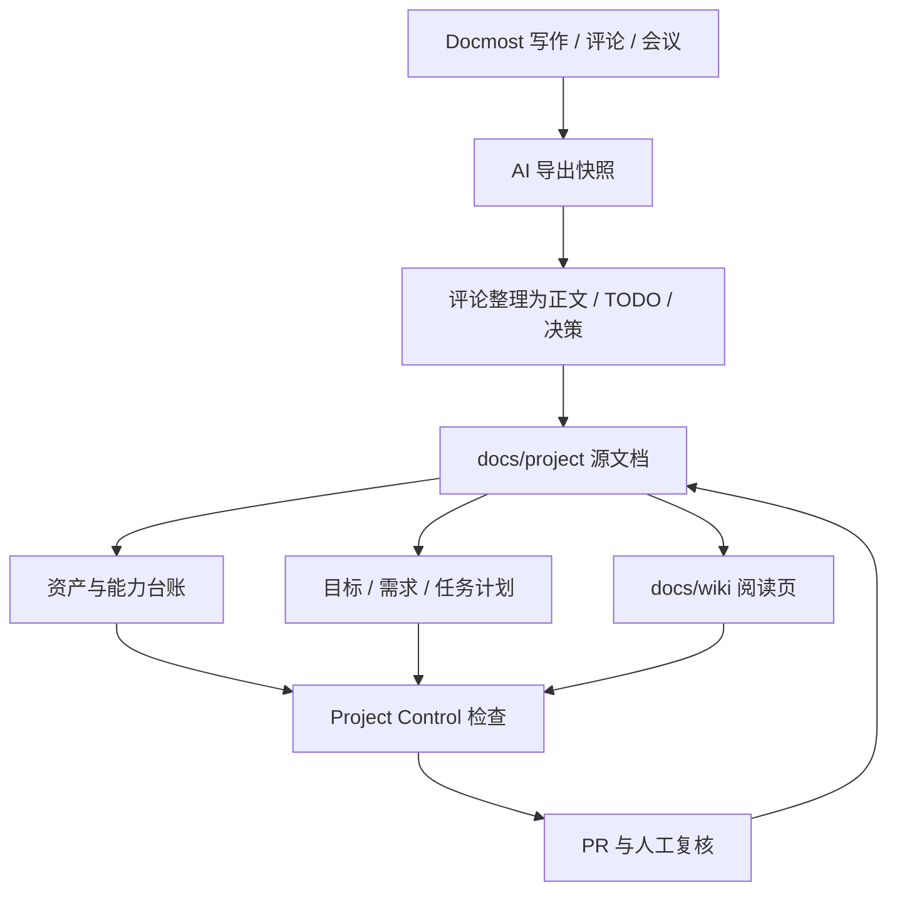

# 进展总览

- 状态: Draft
- 负责人: Team
- 范围: project-progress-overview
- 最后复核: 2026-05-29

## 当前核心方向

当前核心方向是把 Wiki、Docmost、项目管理文件和 Git 快照合成一个轻量项目驾驶舱：

```text
团队在 Docmost 写作、评论、开会
  -> AI 导出快照并整理评论
  -> 更新 docs/project/、docs/wiki/ 和台账
  -> 生成目标 / 需求 / 任务总览
  -> 生成 PR
  -> 人类复核后合并
```

这个方向的目标不是引入重型企业项目管理系统，而是让项目事实足够清晰，AI 可以低成本维护。

## 方向评估

| 方向 | 当前判断 | 成熟度 | 证据 | 下一步 |
| --- | --- | --- | --- | --- |
| 中文 Wiki 阅读层 | 已可本地构建和发布，适合做稳定阅读入口。 | prototype | `tools/wiki_site/README.md` | 补齐进展、资产与能力页面。 |
| Docmost 协作层 | 适合评论、富文本、会议纪要和临时协作。 | prototype | `tools/docmost_mirror/README.md` | 本地试运行一到两周，再决定是否上云。 |
| Repo-first 项目管理 | 会议纪要、TODO、里程碑、状态快照已进入仓库。 | validated | `docs/project/README.md` | 增加资产/能力/进展台账并用脚本检查。 |
| GitHub 信号同步 | Issues、Milestones、Discussions 已能生成只读快照。 | validated | `tools/project_sync/README.md` | 继续评估自动同步 PR。 |
| 资产与能力台账 | V1 开始落地，帮助 AI 维护项目事实。 | prototype | `docs/project/assets/registry.json` | 先维护核心对象，不扩大到所有文件。 |
| 目标-需求-任务计划 | V1 开始落地，可自动生成统计总览和甘特图。 | prototype | `docs/project/planning/dashboard.md` | 根据 Docmost 讨论继续补真实目标和需求。 |
| 内容设计治理 | Wiki 正在承接设计阅读入口，旧文档仍需分批治理。 | draft | `docs/wiki/design.md` | 只提候选归档/删除清单，不主动删除。 |
| 战斗设计分析能力 | 工具链和文档很丰富，但入口复杂。 | validated | `tools/combat_analysis/README.md` | 用能力台账标出最可靠入口。 |

## 管理闭环



## 近期优先级

| 优先级 | 工作 | 完成信号 |
| --- | --- | --- |
| P0 | 本地 Docmost 试运行 | 评论、会议纪要、TODO 能被导出并整理回 Git。 |
| P0 | 资产与能力台账 V1 | `docs/project/assets/` 和 `docs/project/capabilities/` 可被检查脚本验证。 |
| P0 | 目标-需求-任务计划 V1 | `docs/project/planning/dashboard.md` 能统计进展并生成甘特图。 |
| P1 | 进展总览进入 Wiki | Wiki 首页、项目管理页能链接到进展和资产页面。 |
| P1 | Project Control 检查 | 能检查台账 ID、状态、入口文件和关键项目管理文件。 |
| P2 | 设计文档分批治理 | 每批只提出候选，删除或归档经过 owner 确认。 |

## 当前边界

1. 不主动删除文档。
2. 不把 Docmost 评论当长期档案；评论处理后必须转成正文、TODO、会议纪要或拒绝记录。
3. Docmost 是协作入口，Git 是审计和 AI 感知层。
4. 台账 V1 只维护核心资产和能力，不追踪所有小文件。
