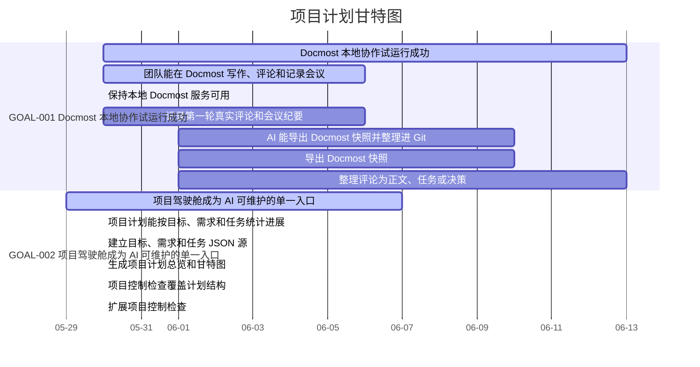

# 项目计划

- 状态: Draft
- 负责人: Team
- 范围: goals-requirements-tasks-dashboard
- 权威性: No
- 最后复核: 2026-05-30

## 说明

源数据在 [docs/project/planning/](../project/planning/README.md)。本页是面向阅读的 Wiki 摘要。

结构采用：

```text
目标 Goal
  -> 需求 Requirement
    -> 任务 Task
```

里程碑是横向时间容器，不作为第四层。

## 总览

| 指标 | 当前值 |
| --- | --- |
| 目标 | 2 |
| 需求 | 4 |
| 任务 | 7 |
| 整体完成率 | 62% |
| 已完成任务 | 4 |
| 阻塞任务 | 0 |

## 状态分布

| 层级 | 状态分布 |
| --- | --- |
| 目标 | active: 2 |
| 需求 | active: 3, planned: 1 |
| 任务 | done: 4, planned: 3 |

## 目标进展

| ID | 目标 | 状态 | 里程碑 | 完成率 | 下一步 |
| --- | --- | --- | --- | --- | --- |
| GOAL-001 | Docmost 本地协作试运行成功 | active | M6 | 25% | 让团队先本地改几轮，再由 AI 导出并整理。 |
| GOAL-002 | 项目驾驶舱成为 AI 可维护的单一入口 | active | M5 | 100% | 把计划总览接入 Wiki 和项目控制检查。 |

## 需求进展

| ID | 所属目标 | 需求 | 状态 | 完成率 | 下一步 |
| --- | --- | --- | --- | --- | --- |
| REQ-001 | GOAL-001 | 团队能在 Docmost 写作、评论和记录会议 | active | 50% | 由团队继续在本地 Docmost 里改内容。 |
| REQ-002 | GOAL-001 | AI 能导出 Docmost 快照并整理进 Git | planned | 0% | 等待团队完成第一轮本地修改后导出快照。 |
| REQ-003 | GOAL-002 | 项目计划能按目标、需求和任务统计进展 | active | 100% | 生成 dashboard 并接入 Wiki。 |
| REQ-004 | GOAL-002 | 项目控制检查覆盖计划结构 | active | 100% | 扩展 `scripts/check_project_control.py`。 |

## 任务列表

| ID | 所属需求 | 任务 | 状态 | 负责人 | 目标日期 | 下一步 |
| --- | --- | --- | --- | --- | --- | --- |
| TASK-001 | REQ-001 | 保持本地 Docmost 服务可用 | done | Codex | 2026-05-30 | 团队继续在 Docmost 里编辑内容。 |
| TASK-002 | REQ-001 | 记录第一轮真实评论和会议纪要 | planned | Team | 2026-06-06 | 在 Docmost 里继续写作、评论和开会。 |
| TASK-003 | REQ-002 | 导出 Docmost 快照 | planned | Codex | 2026-06-10 | 等团队完成一轮修改后执行导出。 |
| TASK-004 | REQ-002 | 整理评论为正文、任务或决策 | planned | Codex | 2026-06-13 | 基于下一次 Docmost 快照整理。 |
| TASK-005 | REQ-003 | 建立目标、需求和任务 JSON 源 | done | Codex | 2026-05-30 | 后续由 AI 根据 Docmost 讨论继续追加。 |
| TASK-006 | REQ-003 | 生成项目计划总览和甘特图 | done | Codex | 2026-05-30 | 让 Wiki 构建器渲染新页面。 |
| TASK-007 | REQ-004 | 扩展项目控制检查 | done | Codex | 2026-05-30 | 后续把计划检查作为项目管理维护默认动作。 |

## 甘特图



## 维护入口

| 源 | 入口 |
| --- | --- |
| 项目计划目录 | [docs/project/planning/](../project/planning/README.md) |
| 目标源 | [goals.json](../project/planning/goals.json) |
| 需求源 | [requirements.json](../project/planning/requirements.json) |
| 任务源 | [tasks.json](../project/planning/tasks.json) |
