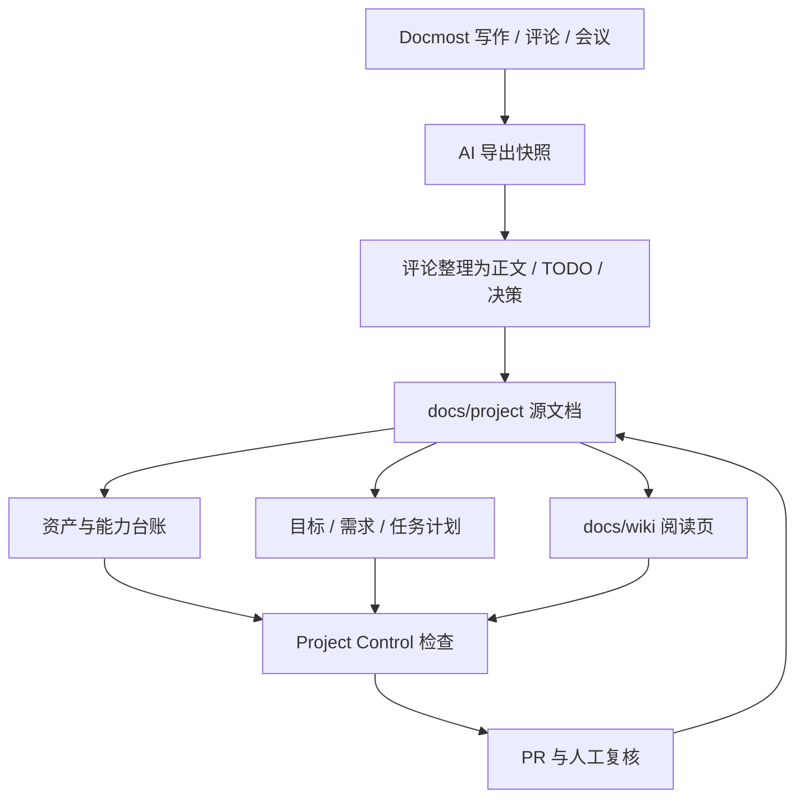

# 进展总览

- 状态: Draft
- 负责人: Team
- 范围: 项目驾驶舱与进展评估
- 权威性: No
- 最后复核: 2026-05-29

## 当前核心方向

当前最重要的方向是把 Wiki 做成项目驾驶舱：让项目进展、资产、能力、TODO、里程碑和讨论摘要都能被人浏览，也能被 AI 稳定读取和核对。

源头记录在 [docs/project/progress/overview.md](../project/progress/overview.md)。本页是给人阅读的 Wiki 摘要。

## 方向评估

| 方向 | 当前判断 | 成熟度 | 证据 | 下一步 |
| --- | --- | --- | --- | --- |
| 中文 Wiki 阅读层 | 已可本地预览、可发布，并开始有分级导航。 | 原型 | [Wiki 构建器](../../tools/wiki_site/README.md) | 补齐进展总览和资产管理页面。 |
| Docmost 协作层 | 适合富文本、评论、会议纪要和临时讨论。 | 原型 | [Docmost Mirror](../../tools/docmost_mirror/README.md) | 本地试运行一到两周。 |
| Repo-first 项目管理 | 会议纪要、TODO、里程碑、当前状态已经进入仓库。 | 已验证 | [项目管理入口](../project/README.md) | 用检查工具降低手工维护漂移。 |
| GitHub 信号同步 | Issues、Milestones、Discussions 已能生成只读快照。 | 已验证 | [GitHub 同步报告](../project/status/github.md) | 评估自动同步 PR。 |
| 资产与能力台账 | V1 已建立，开始成为 AI 维护项目事实的入口。 | 原型 | [资产与能力](assets.md) | 先维护核心资产和能力。 |
| 目标-需求-任务计划 | V1 已建立，可自动统计进展并生成甘特图。 | 原型 | [项目计划](planning.md) | 根据 Docmost 讨论继续补真实目标和需求。 |
| 内容设计治理 | Wiki 正在承接设计阅读入口，旧文档仍需分批治理。 | 草案 | [设计总览](design.md) | 只提候选清单，不主动删除。 |
| 战斗设计分析能力 | 工具链强，但入口很多，需要台账帮助定位。 | 已验证 | [Combat Analysis](../../tools/combat_analysis/README.md) | 标出最常用和最可靠入口。 |

## 管理闭环

## 近期优先级

| 优先级 | 工作 | 完成信号 |
| --- | --- | --- |
| P0 | 本地 Docmost 试运行 | 评论、会议纪要、TODO 能被导出并整理回 Git。 |
| P0 | 资产与能力台账 V1 | `docs/project/assets/` 和 `docs/project/capabilities/` 可被检查脚本验证。 |
| P0 | 目标-需求-任务计划 V1 | `docs/project/planning/dashboard.md` 能统计进展并生成甘特图。 |
| P1 | 进展总览进入 Wiki | Wiki 首页、项目管理页能链接到进展和资产页面。 |
| P1 | Project Control 检查 | 能检查台账 ID、状态、入口文件和关键项目管理文件。 |
| P2 | 设计文档分批治理 | 每批只提出候选，删除或归档经过 owner 确认。 |

## 读法

| 想知道 | 去哪里 |
| --- | --- |
| 当前项目管理事实 | [项目管理](project.md) |
| 当前目标、需求和任务 | [项目计划](planning.md) |
| 资产和能力是否可靠 | [资产与能力](assets.md) |
| 当前设计哪些可信 | [设计总览](design.md) |
| 当前协作和发布方式 | [开发与治理](development.md) |
| 机器可读进展源 | [docs/project/progress/overview.md](../project/progress/overview.md) |
